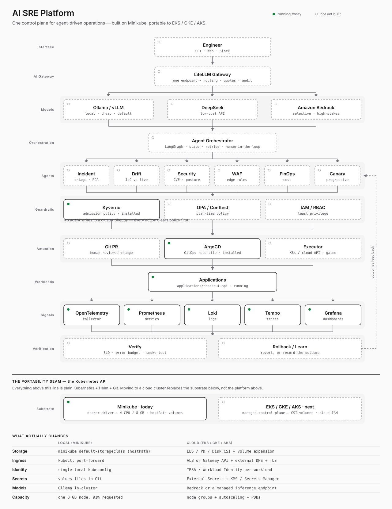

# AI SRE Platform — Implementation Log



Local Kubernetes foundation for an agent-driven SRE platform, built on Minikube and
designed to move to EKS/GKE/AKS without changing the platform layer.

**Status as of 2026-09-04 05:00 WAT** — the Kubernetes and observability substrate is
running. The AI layer (gateway, orchestrator, agents) is not built yet.

---

## How this log was reconstructed

The work was done interactively in a terminal, so this log is rebuilt from primary
sources rather than from a recording:

| Source | What it established |
|---|---|
| `helm history` / `helm get values --revision N` | Exact install/upgrade times and the precise values used at each revision — this is what reveals the retries |
| `kubectl get` / `describe` | Live state, resource ages, pending pods, webhook state |
| `git log`, `git show` | Repo checkpoints and committed file contents |
| `~/.zsh_history` | Helm repo adds and the Loki push/query smoke test |
| Session transcript | The verbatim Kyverno admission error |

Commands below marked **(reconstructed)** are derived from release metadata rather than
copied from history — the values and outcomes are verified, the exact flag spelling may
have differed. Everything else is verbatim or verified against live state.

---

## Verified timeline

| Time (WAT) | Event | Evidence |
|---|---|---|
| Sep 3, 23:57 | Minikube cluster created | node age |
| Sep 4, 00:04:16 | `chore: initialize AI SRE platform` | git |
| 00:11–00:12 | Namespaces created | namespace ages |
| 00:56:48 | Kyverno 3.9.0 / v1.19.0 installed into `security` | helm history |
| ~01:5x | **kube-prometheus-stack install blocked by Kyverno** | error output |
| 01:55:01 | monitoring rev 1 — installed with **no values** | `helm get values --revision 1` → `null` |
| 03:38:02 | monitoring rev 2 — team labels applied | rev 2 values |
| 03:59:46 | otel rev 1 | helm history |
| 04:12:47 | loki rev 1 | helm history |
| 04:18:29 | loki rev 2 — **`replication_factor: 1` added** | rev 1 vs 2 diff |
| 04:19:04 | loki rev 3 — identical values (re-run) | rev 2 vs 3 diff |
| 04:24:21 | otel rev 2 — **`null` → `{}`** in collector config | rev 1 vs 2 diff |
| 04:35:48 | tempo rev 1 | helm history |
| ~04:39 | `checkout-api` applied imperatively | pod age |
| ~04:42 | ArgoCD installed | namespace age |
| 04:45:45 | `feat: establish Kubernetes platform foundation` | git |

---

# Part 1 — Step-by-step replay

This is the corrected sequence. Where a step originally failed, the failure is called
out and cross-referenced to its anatomy in Part 2.

## Step 0 — Cluster

```bash
minikube start --cpus=4 --memory=8192 --driver=docker
minikube addons enable metrics-server
minikube addons enable dashboard
```

Enabled addons: `default-storageclass`, `storage-provisioner`, `metrics-server`,
`dashboard`.

> ⚠️ **Config/runtime mismatch.** `minikube config view` persists `cpus: 4, memory: 8192`,
> but the live node reports **14 CPU / 11.7 GiB allocatable**. The persisted config was
> set after the cluster was created, and resource changes only take effect on
> `minikube delete && minikube start`. Worth reconciling — capacity assumptions in this
> log are based on the *live* 11.7 GiB, and the cluster is already at 91% memory
> requested. See [E5](#e5).

## Step 1 — Namespaces

A namespace-per-concern layout, created up front:

```bash
for ns in platform-system observability security gitops \
          ai-system agents data applications; do
  kubectl create namespace "$ns"
done
```

| Namespace | Purpose | In use? |
|---|---|---|
| `security` | Kyverno | ✅ |
| `observability` | Prometheus, Loki, Tempo, OTel, Grafana | ✅ |
| `applications` | workloads (`checkout-api`) | ✅ |
| `argocd` | ArgoCD (created by the install manifest) | ✅ |
| `platform-system`, `gitops`, `ai-system`, `agents`, `data` | reserved for the AI layer | ⬜ empty |

## Step 2 — Helm repositories

```bash
helm repo add kyverno https://kyverno.github.io/kyverno/
helm repo add prometheus-community https://prometheus-community.github.io/helm-charts
helm repo add grafana https://grafana.github.io/helm-charts
helm repo add open-telemetry https://open-telemetry.github.io/opentelemetry-helm-charts
helm repo update
```

## Step 3 — Kyverno

```bash
helm install kyverno kyverno/kyverno --namespace security
```

Installed with **no custom values** (`helm get values kyverno -n security` → `null`).
Chart 3.9.0, app v1.19.0. Four controllers: admission, background, cleanup, reports.

## Step 4 — The label policy

`policies/kubernetes/require-labels.yaml` — every Pod must carry a `team` label.

```bash
kubectl apply -f policies/kubernetes/require-labels.yaml
kubectl run good-pod --image=nginx --labels=team=platform   # passes
kubectl run bad-pod  --image=nginx                          # denied
```

`bad-pod.yaml` in the repo root is the test fixture for this (it is named `bad-pod.yaml`
but declares `name: good-pod` with `team: platform123` — i.e. it is the *passing* case).

> 🛑 **This is where the install broke.** With this policy active, the next step failed.
> See [E1](#e1) — the most instructive failure in this build.

## Step 5 — Metrics: kube-prometheus-stack

The naive command, which fails against the policy from Step 4:

```bash
helm install monitoring prometheus-community/kube-prometheus-stack \
  --namespace observability --create-namespace
```

The working command:

```bash
helm install monitoring prometheus-community/kube-prometheus-stack \
  --namespace observability --create-namespace \
  -f platform/observability/kube-prometheus-stack-values.yaml
```

The values file sets `team` through **five different keys**, because the chart's pods come
from five different places. This was verified by rendering the chart and inspecting every
pod template — all 8 pod-owning resources carry the label, 0 missing:

```
OK  Job          monitoring-kube-prometheus-admission-create   <- commonLabels
OK  Job          monitoring-kube-prometheus-admission-patch    <- commonLabels
OK  Deployment   monitoring-kube-prometheus-operator           <- commonLabels
OK  Prometheus   monitoring-kube-prometheus-prometheus         <- prometheusSpec.podMetadata
OK  Alertmanager monitoring-kube-prometheus-alertmanager       <- alertmanagerSpec.podMetadata
OK  Deployment   monitoring-grafana                            <- grafana.podLabels
OK  Deployment   monitoring-kube-state-metrics                 <- kube-state-metrics.customLabels
OK  DaemonSet    monitoring-prometheus-node-exporter           <- prometheus-node-exporter.podLabels
```

## Step 6 — Traces: OpenTelemetry Collector

```bash
helm install otel open-telemetry/opentelemetry-collector \
  --namespace observability \
  -f platform/observability/otel-values.yaml
```

Deployment mode, `otel/opentelemetry-collector-k8s` image, OTLP gRPC + HTTP in, `debug`
exporter out.

> ⚠️ Took two revisions. See [E4](#e4) — `null` vs `{}`.

## Step 7 — Logs: Loki

```bash
helm install loki grafana/loki \
  --namespace observability \
  -f platform/observability/loki-values.yaml
```

Single-binary mode with filesystem storage and the other deployment-mode component
replica counts zeroed out, since `SimpleScalable` is the chart default.

> ⚠️ Took three revisions. See [E2](#e2) — `replication_factor`.

Smoke test (verbatim from history):

```bash
kubectl port-forward --namespace observability svc/loki-gateway 3100:80 &

curl -H "Content-Type: application/json" -XPOST -s "http://127.0.0.1:3100/loki/api/v1/push" \
  --data-raw "{\"streams\": [{\"stream\": {\"job\": \"test\"}, \"values\": [[\"$(date +%s)000000000\", \"fizzbuzz\"]]}]}"

curl "http://127.0.0.1:3100/loki/api/v1/query_range" \
  --data-urlencode 'query={job="test"}' | jq .data.result
```

## Step 8 — Traces backend: Tempo

```bash
helm install tempo grafana/tempo \
  --namespace observability \
  -f platform/observability/tempo-values.yaml
```

Local storage backend, 10Gi PVC, 24h retention. Installed cleanly on the first attempt.

## Step 9 — GitOps: ArgoCD

```bash
kubectl create namespace argocd
kubectl apply -n argocd -f https://raw.githubusercontent.com/argoproj/argo-cd/stable/manifests/install.yaml
kubectl port-forward svc/argocd-server -n argocd 8080:443
argocd admin initial-password -n argocd
```
*(reconstructed — these are the commands present in shell history from earlier ArgoCD work
and they match the installed state.)*

All 7 ArgoCD components are running.

> 🛑 **Incomplete.** `platform/argocd/checkout-api.yaml` is a **0-byte file** and
> `kubectl get applications -n argocd` returns nothing. `checkout-api` was applied
> imperatively with `kubectl apply -f applications/checkout-api/`, so it is running but
> **not under GitOps control**. See [N1](#n1).

---

# Part 2 — Errors encountered, and what actually fixed them

<a id="e1"></a>
## E1 — Kyverno blocked the kube-prometheus-stack pre-install hook

**Symptom**

```
Error: INSTALLATION FAILED: failed pre-install: warning: Hook pre-install
kube-prometheus-stack/templates/prometheus-operator/admission-webhooks/job-patch/job-createSecret.yaml
failed: 1 error occurred:
  * admission webhook "validate.kyverno.svc-fail" denied the request:

resource Job/observability/monitoring-kube-prometheus-admission-create was blocked
due to the following policies

require-team-label:
  autogen-require-team-label: 'validation error: Pods must have a team label.
  rule autogen-require-team-label failed at path /spec/template/metadata/labels/team/'
```

**Anatomy — three things stacked up**

1. The policy matches `kind: Pod`, but Kyverno **autogen** silently expands a Pod rule
   into equivalent rules for every pod controller — hence a rule named
   `autogen-require-team-label` firing on a `Job` the policy never mentions.
2. `validationFailureAction: Enforce` + webhook `validate.kyverno.svc-fail` (failurePolicy
   `Fail`) means a denial is fatal, not advisory.
3. It is a **Helm pre-install hook**. Helm aborts before installing anything, so there is
   no partial release to inspect or roll back — a confusing first-failure experience.

**The trap**

The obvious fix — set a pod label on the offending Job — has no route in this chart.
`prometheusOperator.admissionWebhooks.patch` exposes `podAnnotations` but **no
`podLabels`**. The key that does reach that pod template is top-level `commonLabels`,
via the `kube-prometheus-stack.labels` helper.

But `commonLabels` alone is **not sufficient**. Rendering with only `commonLabels` set
leaves 5 of 8 pod templates bare, because subcharts don't inherit it and the
operator-generated StatefulSets take their pod labels from the CRs:

```
MISS  DaemonSet     monitoring-prometheus-node-exporter
MISS  Deployment    monitoring-grafana
MISS  Deployment    monitoring-kube-state-metrics
MISS  Alertmanager  monitoring-kube-prometheus-alertmanager
MISS  Prometheus    monitoring-kube-prometheus-prometheus
```

Fixing only the hook Job would have cleared the pre-install hook and then failed again
further in — the failure mode this project came closest to.

**What was actually done at the time**

Release history shows monitoring **revision 1 installed at 01:55 with `null` values** —
i.e. the block was cleared by taking the policy out of the way, not by satisfying it. The
labels were applied later, at 03:38, as revision 2.

That ordering explains the current state: **the policy is a file in the repo, but it is
not enforced on the cluster.**

```
$ kubectl get clusterpolicy
No resources found

$ kubectl get validatingwebhookconfiguration | grep resource
kyverno-resource-validating-webhook-cfg    0    4h1m     # 0 webhooks = no policies loaded
```

Kyverno manages that webhook dynamically from the set of installed policies; zero entries
confirms nothing is being enforced.

**The durable fix** — [`platform/observability/kube-prometheus-stack-values.yaml`](../platform/observability/kube-prometheus-stack-values.yaml),
verified to cover all 8 pod templates. See [N2](#n2) before re-applying the policy.

---

<a id="e2"></a>
## E2 — Loki single-binary: replication factor

**Evidence** — the only difference between loki revision 1 (04:12:47) and revision 2
(04:18:29):

```diff
 loki:
   auth_enabled: false
   storage:
     type: filesystem
   useTestSchema: true
+  commonConfig:
+    replication_factor: 1
```

**Cause** — the `loki` chart defaults to `SimpleScalable` with a replication factor of 3.
Switching `deploymentMode: SingleBinary` and zeroing `read`/`write`/`backend` replicas
leaves one instance, but the ring config still asks for 3 replicas and Loki refuses to
start.

**Fix** — set `loki.commonConfig.replication_factor: 1` explicitly. Shell history confirms
this was tracked down by inspecting the rendered config:
`grep -A5 "commonConfig:" /tmp/loki-values.yaml`.

---

<a id="e3"></a>
## E3 — Loki revision 3: a no-op re-run

Revisions 2 and 3 have **byte-identical user-supplied values**, 35 seconds apart
(04:18:29 → 04:19:04). This is a `helm upgrade` re-run — the values were already correct,
and the pod needed time to restart and pass readiness.

Worth naming as its own entry because it is a common waste of time: re-running `helm
upgrade` does not make a pod become ready faster. `kubectl get pods -w` or
`kubectl rollout status` is the right tool at that moment.

---

<a id="e4"></a>
## E4 — OTel Collector: `null` vs `{}`

**Evidence** — otel revision 1 (03:59:46) vs revision 2 (04:24:21):

```diff
 config:
   exporters:
-    debug: null
+    debug: {}
   processors:
-    batch: null
+    batch: {}
   receivers:
     otlp:
       protocols:
-        grpc: null
-        http: null
+        grpc: {}
+        http: {}
```

**Cause** — in the collector's config, a component key with an *empty map* value means
"enable with defaults". A key with a `null` value is a different thing, and the collector
rejects it when decoding the pipeline.

`null` is what you get from `--set config.exporters.debug=` on the command line;
`{}` is what you get from a values file that writes `debug: {}` explicitly. Revision 2
switched to the file at [`platform/observability/otel-values.yaml`](../platform/observability/otel-values.yaml).

**Rule of thumb** — configure the OTel Collector from a `-f` values file, never `--set`.
Nested YAML with meaningful empty maps does not survive `--set`.

---

<a id="e5"></a>
## E5 — `loki-results-cache-0` stuck Pending (unresolved)

```
$ kubectl get pods -n observability | grep results-cache
loki-results-cache-0    0/2    Pending    0    46m

$ kubectl describe pod loki-results-cache-0 -n observability
Warning  FailedScheduling  (x12 over 46m)  default-scheduler
  0/1 nodes are available: 1 Insufficient memory.
```

**Arithmetic** — the pod is not misconfigured, the node is simply full:

| | |
|---|---|
| Node allocatable memory | 11,948 Mi (11.7 GiB) |
| Already requested | 10,898 Mi (**91%**) |
| `loki-results-cache` memcached request | 1,229 Mi |
| Total needed | 12,127 Mi → **179 Mi over** |

**Options**, cheapest first:

```bash
# 1. Turn off the results cache — it is a query accelerator, not required
helm upgrade loki grafana/loki -n observability \
  -f platform/observability/loki-values.yaml \
  --set resultsCache.enabled=false

# 2. Shrink it
--set resultsCache.allocatedMemory=256

# 3. Give the cluster more memory (requires recreate — see Step 0)
minikube delete && minikube start --cpus=4 --memory=12288 --driver=docker
```

Option 1 or 2 is right for a laptop. This is the single-node reality that goes away on
EKS — see Part 5.

---

<a id="e6"></a>
## E6 — Malformed `exclude` block in the policy (fixed)

Found in the working tree while writing this log. An in-progress edit had placed
`exclude` at **`spec.exclude`** instead of **`spec.rules[].exclude`**, which also swallowed
the `validate` block into the exclude list item, leaving the rule with nothing to validate:

```
$ kubectl apply -f policies/kubernetes/require-labels.yaml --dry-run=server
Error from server (BadRequest): ClusterPolicy in version "v1" cannot be handled as a
ClusterPolicy: strict decoding error: unknown field "spec.exclude"
```

The file could not be applied at all. `exclude` is a rule-level field, a sibling of
`match` and `validate`. Corrected, preserving the intent of excluding `observability`,
and verified:

```
$ kubectl apply -f policies/kubernetes/require-labels.yaml --dry-run=server
clusterpolicy.kyverno.io/require-team-label created (server dry run)
```

Nothing was applied for real — see [N2](#n2) for why that matters.

---

<a id="e7"></a>
## E7 — Two deprecation warnings from Kyverno v1.19

Surfaced by server-side dry-run:

```
Warning: ClusterPolicy (kyverno.io) is deprecated and will be removed in a future
release; migrate to ValidatingPolicy, MutatingPolicy, GeneratingPolicy or
ImageValidatingPolicy (policies.kyverno.io)
```

1. **`ClusterPolicy` itself is deprecated.** v1.19 wants the CEL-based
   `ValidatingPolicy` (`policies.kyverno.io`) — the CRD is present with `v1` served.
2. **`spec.validationFailureAction` is deprecated** in favour of per-rule
   `spec.rules[].validate.failureAction`. Both were confirmed to still work on this
   cluster, so this is not urgent — but a policy library written today should target
   `ValidatingPolicy`, since this is the layer the whole guardrail story depends on.

---

# Part 3 — Current state

## Running

```
$ helm list -A
NAME        NAMESPACE      REV  CHART                            APP VERSION
kyverno     security       1    kyverno-3.9.0                    v1.19.0
monitoring  observability  2    kube-prometheus-stack-89.1.0     v0.93.1
otel        observability  2    opentelemetry-collector-0.172.0  0.159.0
loki        observability  3    loki-7.3.0                       3.6.12
tempo       observability  1    tempo-1.24.4                     2.9.0
```

Plus ArgoCD (7/7 pods) and `checkout-api` (1/1) in `applications`.

12 of 13 pods in `observability` are healthy; the exception is [E5](#e5).

## Not built

The entire AI layer: LiteLLM gateway, model routing (Ollama / DeepSeek / Bedrock),
LangGraph orchestrator, the six agents, OPA, the executor, and the verify/rollback loop.
The `ai-system`, `agents`, `platform-system`, `gitops` and `data` namespaces are empty
placeholders for it.

## Repository

```
applications/checkout-api/{deployment,service}.yaml   demo workload, team: payments
platform/argocd/checkout-api.yaml                     ⚠️ 0 bytes
platform/observability/kube-prometheus-stack-values.yaml
platform/observability/{loki,otel,tempo}-values.yaml
policies/kubernetes/require-labels.yaml               ⚠️ not applied to the cluster
bad-pod.yaml                                          policy test fixture
docs/IMPLEMENTATION.md, docs/architecture.svg
```

---

# Part 4 — Open items

<a id="n1"></a>
## N1 — Close the GitOps loop (highest value)

ArgoCD is running but manages nothing, and `checkout-api` was applied by hand. Right now
the cluster is not reconciled from Git, which is the property the whole "agent proposes a
change, Git is the audit trail" design depends on. Filling in the empty
`platform/argocd/checkout-api.yaml` with an `Application` pointing at
`applications/checkout-api/` is the smallest change that makes the architecture real.

<a id="n2"></a>
## N2 — Re-applying the label policy will break 18 running pods

**Do not `kubectl apply` the policy as it currently stands without reading this.**
18 pods outside `kube-system` have no `team` label today:

```
argocd/                 7 pods (all ArgoCD components)
security/               4 pods (all four Kyverno controllers)
observability/          5 pods (loki-canary, loki-chunks-cache, loki-gateway,
                                loki-results-cache, otel-opentelemetry-collector)
kubernetes-dashboard/   2 pods
```

Running pods are not retroactively evicted — admission only applies to new ones. But every
one of these would be **blocked on next restart, rollout, or node reboot**.

The `security` namespace is the dangerous one: if a Kyverno controller pod is evicted and
its own policy blocks it from rescheduling, the admission webhook stays down with
`failurePolicy: Fail` and the cluster stops accepting workloads. **Exclude the namespace
that runs the policy engine.** Suggested exclusion set, dry-run verified on this cluster:

```yaml
      exclude:
        any:
          - resources:
              namespaces:
                - kube-system
                - kube-public
                - kube-node-lease
                - security              # Kyverno itself — prevents a deadlock
                - argocd
                - kubernetes-dashboard
```

The current file excludes `observability` instead. That works, but it is a bigger hammer
than needed: with `kube-prometheus-stack-values.yaml` in place the monitoring stack
already complies, and the remaining 5 pods can be labelled properly. Verified keys —
rendering `loki` with these additions puts `team` on all 5 of its pod templates:

```yaml
# platform/observability/loki-values.yaml
gateway:
  podLabels: {team: platform}
lokiCanary:
  podLabels: {team: platform}
chunksCache:
  podLabels: {team: platform}
resultsCache:
  podLabels: {team: platform}

# platform/observability/otel-values.yaml  (top-level key)
podLabels: {team: platform}
```

Then drop `observability` from the exclusion list and the policy covers the workloads it
was written for.

**Safe rollout order:** set `validationFailureAction: Audit` → apply → read
`kubectl get policyreport -A` for real violations → fix them → switch to `Enforce`.
Audit mode is the step that was skipped the first time, and it is what turns E1 from a
failed install into a report.

## N3 — Smaller items

- Reconcile the Minikube config/runtime mismatch ([Step 0](#step-0--cluster)).
- Resolve `loki-results-cache-0` ([E5](#e5)).
- OTel currently exports to `debug` only — nothing flows to Tempo or Loki yet. Wiring
  `otlp → tempo` and `loki` exporters is what makes the Signals layer of the diagram true.
- Plan the `ClusterPolicy` → `ValidatingPolicy` migration ([E7](#e7)).

---

# Part 5 — Moving to EKS or another managed cluster

Everything above the Kubernetes API is plain Kubernetes + Helm + Git and moves unchanged.
What actually changes:

| Concern | Minikube today | Managed cluster |
|---|---|---|
| **Storage** | `default-storageclass` addon, hostPath | EBS / PD / Disk CSI driver; set `storageClassName` in Loki, Tempo, Prometheus values |
| **Ingress** | `kubectl port-forward` | ALB or Gateway API + ExternalDNS + TLS for Grafana and ArgoCD |
| **Identity** | one local kubeconfig | IRSA / Workload Identity per workload; the executor's cloud permissions become the real blast-radius control |
| **Secrets** | values files in Git | External Secrets Operator + KMS / Secrets Manager |
| **Capacity** | one node, 91% requested, [E5](#e5) | node groups + Cluster Autoscaler; set PDBs and real requests/limits |
| **Models** | Ollama in-cluster | Bedrock or a managed endpoint; only the LiteLLM route changes |
| **Retention** | 24h, local disk | object storage (S3/GCS) for Loki and Tempo; raise retention |

Two things to fix *before* migrating, because they get more expensive later:

1. **N1** — if the cluster isn't reconciled from Git locally, it won't be in the cloud
   either, and imperative `kubectl apply` against a shared cluster is much worse.
2. **N2** — get the policy enforced in Audit mode now. A guardrail that has never been
   switched on is not a guardrail, and E1 is exactly the class of failure that is far
   cheaper to debug on a laptop than in a shared cluster.

---

# Appendix — Verification cookbook

The techniques that produced the findings in this log, worth reusing.

**Check what a chart will do before letting the cluster judge it.** This is the whole
lesson of E1 — render locally and inspect, rather than installing and reading admission
errors:

```bash
helm template monitoring prometheus-community/kube-prometheus-stack \
  -n observability -f platform/observability/kube-prometheus-stack-values.yaml \
  | grep -c 'team: platform'
```

**Audit every pod template for a required label** (this is what found the 5 missing ones):

```bash
helm template <rel> <chart> -n <ns> -f <values> > /tmp/r.yaml
python3 - <<'PY'
import yaml
for d in yaml.safe_load_all(open('/tmp/r.yaml')):
    if not d: continue
    k = d.get('kind')
    t = None
    if k in ('Deployment','StatefulSet','DaemonSet','Job'):
        t = d['spec']['template']['metadata'].get('labels') or {}
    elif k in ('Prometheus','Alertmanager','ThanosRuler'):
        t = (d['spec'].get('podMetadata') or {}).get('labels') or {}
    if t is None: continue
    print(('OK  ' if t.get('team') else 'MISS'), k, d['metadata']['name'])
PY
```

**Find a chart's real label key instead of guessing** — `podLabels` does not exist
everywhere (`kube-state-metrics` uses `customLabels`, and the webhook patch job has no
label key at all):

```bash
helm show values <repo>/<chart> | grep -n 'podLabels\|customLabels\|commonLabels'
```

**Recover what a past install actually used** — the source for most of this log:

```bash
helm history <rel> -n <ns>
diff <(helm get values <rel> -n <ns> --revision 1) \
     <(helm get values <rel> -n <ns> --revision 2)
```

**Test a policy without enforcing it:**

```bash
kubectl apply -f <policy>.yaml --dry-run=server   # validates, changes nothing
```

**Confirm whether Kyverno is actually enforcing anything** — the check that revealed the
policy was absent:

```bash
kubectl get clusterpolicy
kubectl get validatingwebhookconfiguration kyverno-resource-validating-webhook-cfg \
  -o jsonpath='{range .webhooks[*]}{.name}{"\n"}{end}'   # empty = no policies loaded
```

**Find pods that a label policy would reject:**

```bash
kubectl get pods -A -o json \
  | jq -r '.items[] | select(.metadata.labels.team == null)
           | "\(.metadata.namespace)/\(.metadata.name)"'
```
